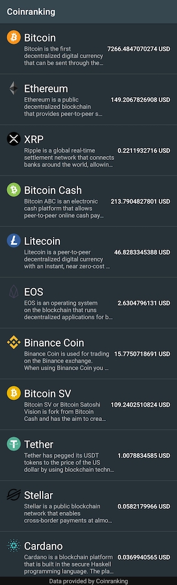
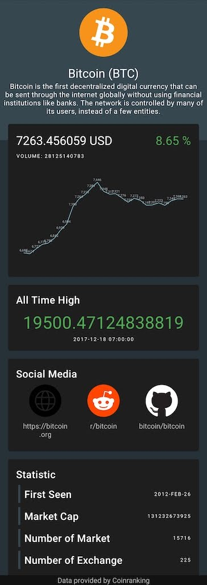
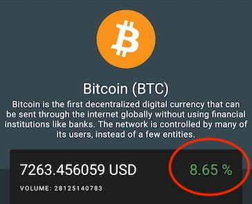

#Wongnai Android Assignment

## Objective

This assignment would like to assess your skills of following topics:
* Android development skills
* API request and handling responses
* Quality of product

## Requirement

* Fetch data from [API](https://api.coinranking.com/v1/public/coins)
* Display list of Cryptocurrencies on main screen
* Click to see detail on the second screen 
* Price diff 
    * display green if positive
    * display red if negative

## Notes

* API can be found at CoinApi.kt
* We prepared code structure and layout (.xml) all ready for you
* You can add more 3rd libraries

## Bonus
* Handle screen rotation

## Outputs

* You have 7 days to complete this assignment from the day the exam is received
* Upload all source codes to the form that include in the email.

|MainFragment.kt|CoinInfoFragment.kt|Price Diff|
|---|---|---|
||||